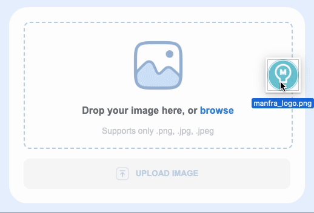

# Uploading images with Node.js

Uploading images with Node.js using Express and Multer on the backend, and image preview, upload progress and drag and drop on the frontend using pure Javascript.

<p align="center">
    
</p>

---

### Version: 1.0.0

### Usage

```sh
$ npm install
```

```sh
$ node index.js
```
